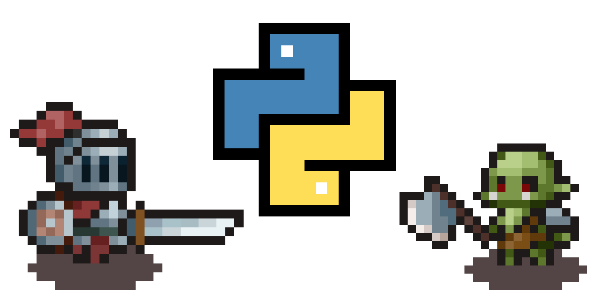
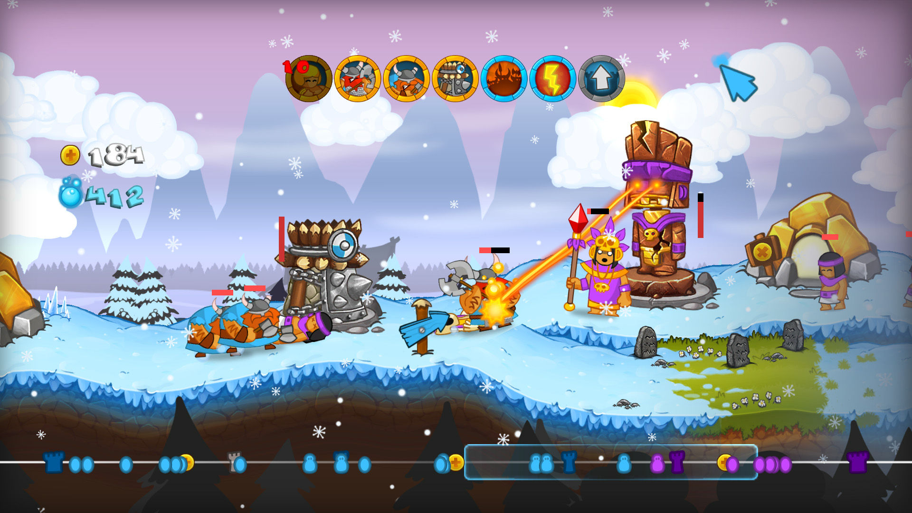
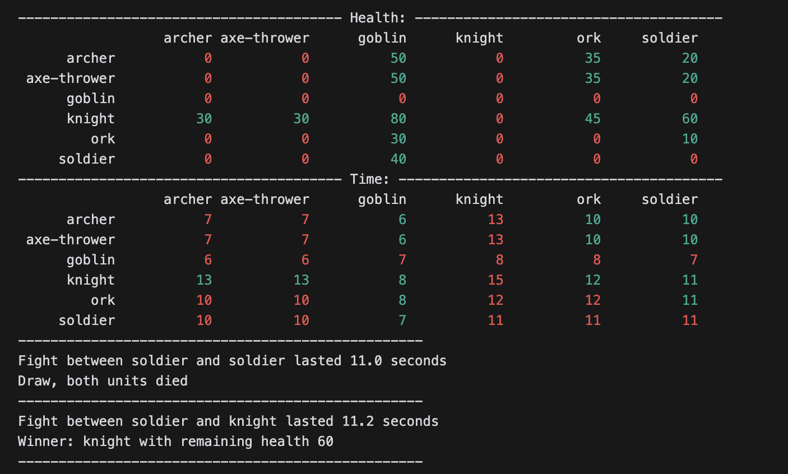

# Python for Game Designers: Simulating a Simple 1v1 Fight



## **Introduction**
In [the previous article](../Articles/PFGD_101_WHY.md), I explored why game designers should consider using Python. Now, we'll dive into a simple example of a game simulation to show how Python can be useful for balancing mechanics. This article demonstrates a straightforward 1v1 fight simulation, highlighting how simulations can help refine gameplay and test balance in a controlled environment.

### **Game Mechanics Overview**

In this example, we'll simulate a simplified 1v1 fight mechanic—a concept I've used in balancing for AILeague Arena. This type of mechanic is common in games where players summon units to defend a tower or attack an enemy. To keep things straightforward, we'll assume the game is 2D, with units moving along a single axis toward enemy towers. Each unit has an attack range and cooldown; when an enemy enters its range, it will attack. Since damage is processed simultaneously, ties are possible, making this simulation particularly useful for understanding balance and unit interactions. Another example of a similar game mechanic is "Swords & Soldiers" by Ronimo Games.




### **Getting Started**

To follow along with this example, you'll need access to Jupyter notebooks. You can install Jupyter locally by following the instructions on Jupyter's official site at https://jupyter.org/install. Alternatively, you can use an online tool like Google Colab (https://colab.research.google.com/), which lets you start coding immediately without any installation.

The code for this article is available on [the GitHub repository](https://github.com/Bryukh/python-for-game-design/blob/main/simple-fight-1v1-101.ipynb).

#### **Overview of Units and Attributes**

Let's take a classic set of fantasy units: soldier, knight, archer, goblin, ork, and axe-thrower. This gives us two factions with a mix of melee and ranged units. Each unit is defined by specific parameters essential to combat simulation. We start with `health`, which tracks the unit's current state. For attacks, we have `attack_damage`, determining how much damage each strike deals, and `attack_cooldown`, which defines the time between attacks, ensuring units don't attack every frame. Ideally, this cooldown should align with the game's frame duration for smoother timing. `Attack_range` is also crucial, as units move toward each other, and even melee units need a defined reach. Finally, we have `speed`, representing movement in meters per second (or another distance unit), allowing us to simulate their approach and positioning in combat.

#### **Data Structure for Units and Attributes**

To manage units and their attributes, we'll use classes to allow direct access to properties with dot notation. While there are other options, such as named tuples or pandas dataframes, this example focuses on using basic Python structures to keep things accessible. The core attributes for each unit type are stored in a dictionary (`UNITS_ATTRIBUTES`), making it easy to read and modify initial stats as needed. Global constants are written in uppercase (`UNITS_ATTRIBUTES` and `UNIT_TYPES`), while unit names use hyphen style.

```python
UNITS_ATTRIBUTES = {
    'soldier': {'health': 100, 'attack_damage': 10, 'speed': 1.5, 'attack_range': 1, 'attack_cooldown': 0.7},
    'knight': {'health': 150, 'attack_damage': 15, 'speed': 1.2, 'attack_range': 1, 'attack_cooldown': 1},
    'archer': {'health': 50, 'attack_damage': 20, 'speed': 1, 'attack_range': 10, 'attack_cooldown': 2},
    'goblin': {'health': 50, 'attack_damage': 10, 'speed': 1.5, 'attack_range': 1, 'attack_cooldown': 0.5},
    'ork': {'health': 100, 'attack_damage': 15, 'speed': 1.2, 'attack_range': 1, 'attack_cooldown': 1},
    'axe-thrower': {'health': 50, 'attack_damage': 20, 'speed': 1, 'attack_range': 10, 'attack_cooldown': 2}
}
UNIT_TYPES = list(UNITS_ATTRIBUTES.keys())
```

`UNIT_TYPES` is a list of unit names that we'll use frequently, so it's initialized once to avoid repeatedly accessing the keys of `UNITS_ATTRIBUTES`.

To encapsulate attributes, the `UnitAttributes` class gives us dot access to properties instead of needing to use dictionary keys. Here's the implementation:

```python
class UnitAttributes:
    def __init__(self, unit_type: str):
        self.unit_type = unit_type
        self.attack_damage = UNITS_ATTRIBUTES[unit_type]['attack_damage']
        self.speed = UNITS_ATTRIBUTES[unit_type]['speed']
        self.attack_range = UNITS_ATTRIBUTES[unit_type]['attack_range']
        self.attack_cooldown = UNITS_ATTRIBUTES[unit_type]['attack_cooldown']
        self.health = UNITS_ATTRIBUTES[unit_type]['health']
```

The `Unit` class stores additional data to manage each unit's state during combat, including:
- `x` – the unit's position.
- `max_health` and `current_health` – to track health changes separately (useful if healing is introduced).
- `current_attack_cooldown` – to track the remaining time until the unit can attack again.

```python
class Unit:
    def __init__(self, unit_type: str, x=0):
        self.type = unit_type
        self.attributes = UnitAttributes(unit_type)
        self.max_health = self.attributes.health
        self.current_health = self.max_health
        self.current_attack_cooldown = 0
        self.x = x
```

This structure keeps the code readable and efficient for simulating combat and tracking each unit's state. In future we move to more complex but more flexible data structures like pandas dataframes and interactive spreadsheets.

### **Functions for Core Mechanics**

Before starting the simulation, we'll define some constants that help control game balance.

- `DT` — DeltaTime, or the frame duration for our simulation. A value of `0.1` works well for our needs, though you can adjust it to fine-tune the simulation.
- `FIELD_SIZE` — The starting distance between units, set to match or exceed the longest attack range in our example.

```python
DT = 0.01
FIELD_SIZE = 15
```

Now, let's introduce some helper functions. These functions support repeated operations and make the main simulation logic easier to follow.

To simplify unit creation, `create_unit` acts as a wrapper for initializing units. Units starting on the left have `x = 0`, while those on the right start at `FIELD_SIZE`.

```python
def create_unit(unit_type: str, x=0) -> Unit:
    return Unit(unit_type, x)
```

**Distance calculations** are essential in any game, even non-combat ones (Levenshtein distance for word games), so we define `distance_between` to measure the separation between two units.

```python
def distance_between(unit1: Unit, unit2: Unit):
    return abs(unit1.x - unit2.x)
```

The function `enemy_in_range` checks if an enemy is within a unit's attack range, which is crucial for deciding when ready to reduce the health of an opponent.

```python
def enemy_in_range(unit: Unit, enemy: Unit):
    return distance_between(unit, enemy) <= unit.attributes.attack_range
```

**Timing for attacks** is controlled by `unit_can_attack`, which verifies if a unit's attack cooldown has reset, allowing it to attack again.

```python
def unit_can_attack(unit: Unit):
    return unit.current_attack_cooldown <= 0
```

**Handling attacks** is done by `process_attack`, a function that changes the state of its arguments—decreasing the enemy's health and resetting the attacker's cooldown. Using state-modifying functions requires caution, as they alter properties of other objects directly.

```python
def process_attack(unit: Unit, enemy: Unit) -> bool:
    if not unit_can_attack(unit):
        return False
    enemy.current_health -= unit.attributes.attack_damage
    unit.current_attack_cooldown = unit.attributes.attack_cooldown
        return True
```

Finally, `move_unit` adjusts the unit's position as it advances toward an opponent. Its name reflects its purpose, though it's also a state-modifying function.

```python
def move_unit(unit: Unit, direction: int):
    unit.x += unit.attributes.speed * direction * DT
```

With these constants and helper functions, we're ready to move into the simulation logic. They provide a solid foundation, improving readability and reducing repetitive code.

#### **Simulating Combat Mechanics**

With our helper functions in place, the core fight simulation becomes straightforward and readable. In designing `simulate_fight`, I prioritized code clarity over complexity, avoiding nested conditionals or list comprehensions. This function takes two unit types as input, initializing two units—one starting on the left and the other on the right. Since both units act simultaneously, their positions offer no inherent advantage.

The fight begins by setting `time` to zero, and a `while` loop runs as long as both units have health remaining. Inside this loop, we check if each unit has an enemy within attack range. If a unit is in range, `process_attack` is called, where attack cooldowns are enforced, and enemy health is reduced. Notably, we only check health at the beginning of each loop, meaning a "dead" unit can still deliver a final strike if attacked during the same cycle.

When units are out of range, they advance toward each other with `move_unit`. At the end of each loop cycle, we decrement each unit's `attack_cooldown`, ensuring it doesn't drop below zero, and increment `time` by `DT` to track the fight duration.

Once the fight concludes, `simulate_fight` returns three values: the duration, the remaining health of `unit1`, and the remaining health of `unit2`.

A note on the `while` loop: This approach works well for a simple fight, but if we added mechanics like healing or incorrect speeds, the loop could theoretically run indefinitely. A time-based stopping condition might be a helpful addition for future versions, though it's beyond this article's scope.

```python
def simulate_fight(unit_type1: str, unit_type2: str):
    unit1 = create_unit(unit_type1, 0)
    unit2 = create_unit(unit_type2, FIELD_SIZE)
    time = 0
    while unit1.current_health > 0 and unit2.current_health > 0:
        if enemy_in_range(unit1, unit2):
            process_attack(unit1, unit2)
        else:
            move_unit(unit1, 1)
        if enemy_in_range(unit2, unit1):
            process_attack(unit2, unit1)
        else:
            move_unit(unit2, -1)
        time += DT
        unit1.current_attack_cooldown = max(0, unit1.current_attack_cooldown - DT)
        unit2.current_attack_cooldown = max(0, unit2.current_attack_cooldown - DT)
    return time, unit1, unit2
```


### **Running the Simulation**

With our combat logic in place, we can now run a full tournament to observe outcomes across all unit pairings. By adjusting `UNIT_ATTRIBUTES`, we can easily re-run the tournament to test balance changes (remember to re-run the cell after any updates to constants to apply them). The loop below initiates a series of 1v1 matches, where each unit type faces off against every other unit type.

```python
results = []
for unit_type1 in UNIT_TYPES:
    for unit_type2 in UNIT_TYPES:
        t, u1, u2 = simulate_fight(unit_type1, unit_type2)
        results.append((t, u1, u2))
```

Since there's no randomness in this simulation, each match has a consistent outcome, so we only need one match per pairing. However, in future iterations, we may introduce randomness to simulate variations in combat, at which point we can analyze average outcomes or use medians to gauge balance across multiple rounds.

#### **Displaying the Results in a Table**

To analyze our simulation outcomes, we need a clear way to view the results. This is where Python notebooks and data visualization tools can shine, making analysis far more flexible than traditional spreadsheets. However, for simplicity in this article, we'll use plain ASCII tables and text to display the outcomes. To help with formatting options for our printed results, I used GitHub Copilot to streamline the code and mix formatting styles easily.

The `print_results` function provides a quick summary of each fight, showing which unit won, how long the fight lasted, and the remaining health of the winner. This function makes it easy to follow the outcome of each individual match.

```python
def print_results(results):
    for time, unit1, unit2 in results:
        print('-' * 50)
        time = round(time, 1)
        print(f'Fight between {unit1.type} and {unit2.type} lasted {time} seconds')
        if unit1.current_health > 0:
            print(f'Winner: {unit1.type} with remaining health {unit1.current_health}')
        elif unit2.current_health > 0:
            print(f'Winner: {unit2.type} with remaining health {unit2.current_health}')
        else:
            print('Draw, both units died')
```

The `print_results_table` function organizes results into an ASCII table, showing the remaining health or fight duration for each unit pairing. This structure makes it easy to spot which units tend to win or lose against others. Rows and columns represent unit types, and cell values display the selected metric (either remaining health or time). Color coding is applied, with green indicating units that survive and red for those defeated.

```python
def print_results_table(results, cell_type="health"):
    # first we need to find all unique unit types
    INTENT = 12
    unit_types = set()
    for _, unit1, unit2 in results:
        unit_types.add(unit1.type)
        unit_types.add(unit2.type)
    unit_types = sorted(list(unit_types))
    # print header
    print(' ' * INTENT, end='')
    for unit_type in unit_types:
        print(f'{unit_type:>{INTENT}}', end='')
    print()
    # print rows
    for unit_type1 in unit_types:
        print(f'{unit_type1:>{INTENT}}', end='')
        for unit_type2 in unit_types:
            # find result for this pair of unit types
            for time, u1, u2 in results:
                if u1.type == unit_type1 and u2.type == unit_type2:
                    break
            else:
                raise Exception(f'No result for {unit_type1} vs {unit_type2}')
            hp = max(u1.current_health, 0)
            if cell_type == "health":
                cell_data = hp
            elif cell_type == "time":
                cell_data = time
            else:
                raise Exception(f'Unknown cell type: {cell_type}')
            if hp == 0:
                print(f'\x1b[31m{cell_data:>{INTENT}.0f}\x1b[0m', end='')
            else:
                print(f'\x1b[32m{cell_data:>{INTENT}.0f}\x1b[0m', end='')
        print()
```

To display both health and fight duration results, use these commands:

```python
print("-" * 40 + " Health: " + "-" * 38)
print_results_table(results, cell_type="health")
print("-" * 40 + " Time: " + "-" * 40)
print_results_table(results, cell_type="time")
print_results(results)
```

These functions let us see at a glance which units prevail and the typical duration of each fight, providing insights into balance and performance for each unit type. Here is how it looks in the notebook:



#### **Analyzing and Interpreting Results**

With these results in hand, we can start adjusting unit attributes, game logic, field size, and more to fine-tune the balance. Even in its simple form, this simulation provides a clearer picture than basic formulas in a spreadsheet. For example, the current setup shows that knights are overpowered while goblins struggle as basic cannon fodder. Of course, we're not yet factoring in costs, crowd dynamics, or abilities that would affect real gameplay balance—topics we'll explore in future articles. This method is a practical starting point for understanding balance in turn-based combat, offering game designers an accessible way to test and iterate on mechanics.

### **Conclusion**

This example illustrates how Python can be a powerful tool for simulating game mechanics, even in a straightforward combat model. By creating a simple 1v1 fight simulation, we gain insights into unit balance and interactions, providing a foundation for more nuanced adjustments. As we continue in this series, we'll explore more complex mechanics, adding layers such as costs, abilities, and group dynamics to refine and deepen our simulations. Python's flexibility and readability make it ideal for this iterative approach, allowing game designers to test ideas efficiently and make data-driven adjustments.
